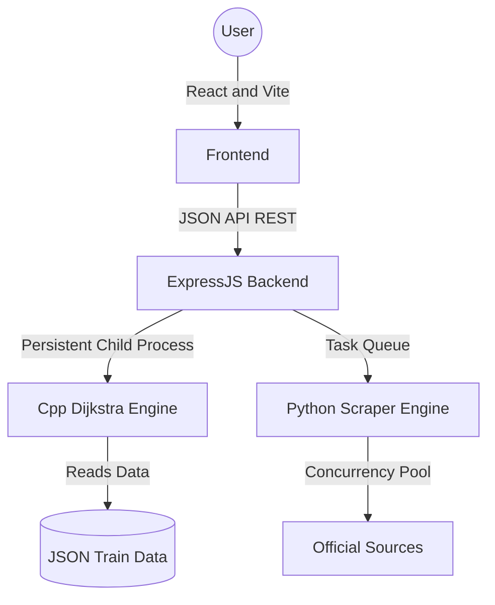

# 🚄 RailYatra: Premium Pathfinding Engine

**RailYatra** is a high-performance train route-finding platform. It features a custom-built C++ navigation engine capable of processing thousands of train schedules to find the most optimal multi-leg journeys across the Indian Railways network.

---

- **Intelligent Station Search**: Fuzzy-matching autocomplete supporting keyboard accessibility and robust typo-tolerance.
- **Live Train Status**: Real-time train tracking via a refined Python scraper with an advanced **Concurrency-Controlled execution model** (Queueing, Caching, and Coalescing).
- **Premium Collections**: Dedicated high-end visual charts for special train categories like Vande Bharat, Tejas, and Gatiman.
- **Modular Data System**: Easily add new train categories by simply adding JSON data files.

---

## 🚀 Key Features

- **Blazing Fast Engine**: Layered multi-pass Dijkstra written in C++17, finding the best 10 routes in under 5ms.
- **Live Train Status**: Real-time tracking with station-wise delay info, platform updates, and current location — powered by a **concurrency-limited Python queue** with 30s response caps.
- **Premium Route Charts**: Modular "Railway Chart" system for special train categories with sequential serial numbers and detailed timings.
- **Multi-Criteria Optimization**: Sort routes by travel time, total distance, or minimum switches.
- **Best 10 Routes**: Returns up to 10 diverse routes — direct trains first, then 1-transfer, then 2-transfer, ranked by total travel time within each tier.
- **Intelligent Transfers**: Validates connecting times at junctions (minimum 30 min buffer, max wait limit configurable).
- **Intelligent Station Search**: Built-in typo-tolerance (`fuse.js`) resolving query variations inside an interactive, keyboard-navigable UI dropdown with live match highlighting.
- **Premium UI**: Modern "RailPath" aesthetic with glassmorphism, smooth animations, and a clean white theme.

---

## 🧠 The Dijkstra Logic (Technical Deep-Dive)

The core navigation engine implements a **Layered Multi-Pass Dijkstra** optimized for scheduled transportation networks. See [`logic.md`](logic.md) for the full technical breakdown.

### 1. Layered Pass Strategy
The engine runs one independent Dijkstra pass per transfer level (0 → 1 → 2 → … up to `maxSwitches`), stopping as soon as 10 results are collected:
- **Pass 0**: Direct routes only (0 transfers) — ranked by total travel time.
- **Pass 1**: Routes with 1 transfer — fills remaining slots, also ranked by time.
- **Pass N**: Continues until 10 unique routes are found.

This guarantees direct routes always come before 1-transfer routes in the output, regardless of cost.

### 2. Destination-Exempt Pruning
The `bestCost[station][switches]` table prunes redundant intermediate paths. Critically, the **destination station is exempt** from this pruning — every train that reaches the destination is evaluated, allowing multiple direct trains to the same endpoint to all appear in results.

### 3. Real-World Constraints
During expansion, every potential connection is validated for:
- **Chronological Validity**: Departing train must leave *after* the previous train arrives.
- **Transfer Window**: Wait time ≥ 30 min and ≤ `max_wait` (default: 20 hours).
- **Switch Budget**: Prunes branches exceeding the per-pass `maxSwitches` cap.

---

## 🛠️ Project Architecture

RailYatra utilizes a **Hybrid Multi-Tier & Micro-Core Architecture** to guarantee extreme pathfinding throughput while maintaining a smooth user experience.



### Architectural Pillars
- **Micro-Core Engine**: To circumvent Node.js CPU bottlenecks, the mathematically heavy Layered Multi-Pass Dijkstra algorithm is offloaded to a persistent, compiled C++17 process (`route_engine.exe`). Logic is encapsulated in `src/services/engine.service.js`.
- **Managed Live Scraper**: A lightweight, refined Python engine (`src/scripts/scraper.py`) managed by an **Asynchronous Concurrency Pool**. This ensures that even under heavy load, the server only spawns a limited number of scraper processes (Max 5) to prevent resource exhaustion.
- **Request Coalescing & Caching**: Multiple simultaneous requests for the same train share a single scraper process (coalescing). Results are cached for **2 minutes** to provide instant responses for popular trains.
- **Strict 30s Response Cap**: A global timeout ensures that users always receive a response within 30 seconds. If the data source is slow or the queue is full, the system responds with a 503 "Try again later" error to maintain UI responsiveness.
- **IP Rate Limiting**: Dedicated rate limiting (10 requests / 15 mins) prevents individual client abuse.
- **Industrial Routing**: The app follows a strict **Controller-Service-Route** pattern.
    - `src/api/routes/`: Defines the endpoints.
    - `src/api/controllers/`: Handles the business logic and engine mediation.
    - `src/services/`: Wraps background processes and external utilities.
- **Asynchronous API Gateway**: A lightweight Express.js server (`src/app.js`) acts as an execution manager and HTTP bridge.
- **"RailPath" Premium UI**: A bespoke frontend built on React 19.

### Tech Stack Breakdown
- **Frontend**: React 19, TypeScript, Vite, Tailwind CSS, Framer Motion, Lucide Icons.
- **Backend / Delivery Layer**: Node.js, Express.js.
- **Navigation Engine**: Modern C++17, `nlohmann/json` macro-library for high-speed deterministic JSON serialization.
- **Live Status Engine**: Python 3, `requests`, `beautifulsoup4`, executed as a stateless child process for thread-safe reliability.

---

## ⚡ Setup & Installation

### 1. Build the Engine
Requires `g++` (MinGW-w64) installed and in your PATH.
```bash
cd engine
./build.ps1
```

### 2. Prepare Data
Ensure `master_train_data.json` is present in the project root. This file contains the pre-processed schedules for all trains.

### 3. Setup Python Virtual Environment (for Live Status)
```bash
cd backend
python -m venv venv

# Windows
venv\Scripts\activate
# Linux/Mac
# source venv/bin/activate

pip install -r requirements.txt
```

### 4. Start the Backend
```bash
cd backend
npm install
node server.js # Starts on Port 3000 (also auto-starts Python service on port 5050)
```

### 5. Start the Frontend
```bash
cd frontend
npm install
npm run dev # Starts on Port 5173
```

## Project Structure

```
backend/
├── src/
│   ├── api/
│   │   ├── controllers/   # Business logic (Route search, Scraper mediation)
│   │   └── routes/        # API route definitions
│   ├── config/            # Cross-platform environment configuration
│   ├── services/          # Persistent background service wrappers
│   ├── scripts/           # Python scraper logic
│   └── app.js             # Express application & middleware setup
├── server.js              # Entry point
├── package.json
└── stations.json
frontend/
├── src/                   # React components and custom hooks
├── public/                # Static assets
└── index.html
```

---

## 📡 API Reference

### `POST /api/route`
Calculates routes between two stations.
| Parameter | Type | Description | Default |
| :--- | :--- | :--- | :--- |
| `from` | `String` | Source station name or code | (Required) |
| `to` | `String` | Destination station name or code | (Required) |
| `date` | `String` | Journey date (YYYY-MM-DD) | (Required) |
| `sort_by` | `String` | `time`, `distance`, or `switches` | `switches` |
| `max_wait` | `Int` | Max wait time at transfers (minutes) | `600` (10h) |
| `max_switches`| `Int` | Max number of transfers allowed | `5` |
| `top_k` | `Int` | Number of results to return | `10` |

### `GET /api/stations`
Fuzzy-autocomplete endpoint for station search powered by Fuse.js. Returns top 10 matches ranked by Levenshtein distance relevance (intelligently handling minor spelling variations like "dehli").

### `GET /api/category/:category`
Fetches a list of trains for a specific collection (e.g., `vandebharat`, `tejas`). Returns premium route chart data.

### `GET /api/schedule/:trainNumber`
Fetches the full schedule for a specific train. Returns station stops, arrival/departure times, and operating days.

### `GET /api/livestatus/:trainNumber`
Fetches real-time running status for a train by scraping NTES. Returns:
- **`meta`**: `train_no`, `start_date`, `current_location`, `fetched_at`, `total_stations`
- **`itinerary`**: Array of station stops with `station`, `platform`, `status`, `is_delayed`, `is_source`, `is_destination`, and `timings` (`sch_arr`, `act_arr`, `sch_dep`, `act_dep`)
- Responses are cached for 2 minutes. Cached responses include `_cached: true`.

### `GET /api/pdf/:trainNumber`
Serves the PDF timetable for the requested train (if available).

---

## 🧪 Verification & Reliability
The system includes a verification suite in `/tests`:
- **Correctness**: Validates that found routes actually exist in the raw JSON schedules.
- **Performance**: Measures engine latency (target: <10ms per search).
- **Integrity**: Ensures no "illegal" transfers (e.g., departing before arrival) are returned.

### Engine Throughput Benchmark
Based on local system benchmarking (Intel i5/equivalent, single-process engine):
- **Average Latency**: ~0.94 ms per route calculation.
- **Throughput**: ~1,067 requests/second.

### Live Status Performance & Reliability
- **Live Fetch**: 5–25s (Throttled by concurrency pool)
- **Response Capping**: 30s (Global user-facing timeout)
- **Concurrency Limit**: Max 5 simultaneous scraper processes.
- **Request Coalescing**: Duplicate in-flight requests for the same train number are merged into a single execution.
- **Caching**: 2-minute TTL for all successful scrapes.
- **Rate Limiting**: 10 requests per 15 minutes per IP to prevent scraper exhaustion.
