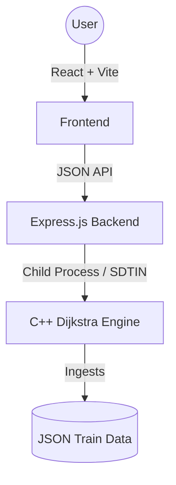

# 🚄 RailYatra: Premium Pathfinding Engine

**RailYatra** is a high-performance train route-finding platform. It features a custom-built C++ navigation engine capable of processing thousands of train schedules to find the most optimal multi-leg journeys across the Indian Railways network.

---

- **Live Station Search**: Autocomplete search for stations.
- **Premium Collections**: Dedicated high-end visual charts for special train categories like Vande Bharat, Tejas, and Gatiman.
- **Modular Data System**: Easily add new train categories by simply adding JSON data files.

---

## 🚀 Key Features

- **Blazing Fast Engine**: Layered multi-pass Dijkstra written in C++17, finding the best 7 routes in under 5ms.
- **Premium Route Charts**: Modular "Railway Chart" system for special train categories with sequential serial numbers and detailed timings.
- **Multi-Criteria Optimization**: Sort routes by travel time, total distance, or minimum switches.
- **Best 7 Routes**: Returns up to 7 diverse routes — direct trains first, then 1-transfer, then 2-transfer, ranked by total travel time within each tier.
- **Intelligent Transfers**: Validates connecting times at junctions (minimum 30 min buffer, max wait limit configurable).
- **Premium UI**: Modern "RailPath" aesthetic with glassmorphism, smooth animations, and a clean white theme.

---

## 🧠 The Dijkstra Logic (Technical Deep-Dive)

The core navigation engine implements a **Layered Multi-Pass Dijkstra** optimized for scheduled transportation networks. See [`logic.md`](logic.md) for the full technical breakdown.

### 1. Layered Pass Strategy
The engine runs one independent Dijkstra pass per transfer level (0 → 1 → 2 → … up to `maxSwitches`), stopping as soon as 7 results are collected:
- **Pass 0**: Direct routes only (0 transfers) — ranked by total travel time.
- **Pass 1**: Routes with 1 transfer — fills remaining slots, also ranked by time.
- **Pass N**: Continues until 7 unique routes are found.

This guarantees direct routes always come before 1-transfer routes in the output, regardless of cost.

### 2. Destination-Exempt Pruning
The `bestCost[station][switches]` table prunes redundant intermediate paths. Critically, the **destination station is exempt** from this pruning — every train that reaches the destination is evaluated, allowing multiple direct trains to the same endpoint to all appear in results.

### 3. Real-World Constraints
During expansion, every potential connection is validated for:
- **Chronological Validity**: Departing train must leave *after* the previous train arrives.
- **Transfer Window**: Wait time ≥ 30 min and ≤ `max_wait` (default: 20 hours).
- **Switch Budget**: Prunes branches exceeding the per-pass `maxSwitches` cap.

---

## 🛠️ Project Architecture



### Tech Stack
- **Frontend**: React 19, TypeScript, Vite, Tailwind CSS, Framer Motion, Lucide Icons.
- **Backend**: Node.js, Express.js.
- **Engine**: C++17, `nlohmann/json` for high-speed serialization.
- **Styling**: Custom "RailPath" design system with "Inter" & "Outfit" typography.

---

## ⚡ Setup & Installation

### 1. Build the Engine
Requires `g++` (MinGW-w64) installed and in your PATH.
```bash
cd engine
./build.ps1
```

### 2. Prepare Data
Ensure `master_train_data.json` is present in the project root. This file contains the pre-processed schedules for all trains.

### 3. Start the Backend
```bash
cd backend
npm install
node server.js # Starts on Port 3000
```

### 4. Start the Frontend
```bash
cd frontend
npm install
npm run dev # Starts on Port 5173
```

---

## 📡 API Reference

### `POST /api/route`
Calculates routes between two stations.
| Parameter | Type | Description | Default |
| :--- | :--- | :--- | :--- |
| `from` | `String` | Source station name or code | (Required) |
| `to` | `String` | Destination station name or code | (Required) |
| `date` | `String` | Journey date (YYYY-MM-DD) | (Required) |
| `sort_by` | `String` | `time`, `distance`, or `switches` | `switches` |
| `max_wait` | `Int` | Max wait time at transfers (minutes) | `1200` (20h) |
| `max_switches`| `Int` | Max number of transfers allowed | `5` |
| `top_k` | `Int` | Number of results to return | `7` |

### `GET /api/stations`
Autocomplete endpoint for station search. Returns top 10 matches.

### `GET /api/category/:category`
Fetches a list of trains for a specific collection (e.g., `vandebharat`, `tejas`). Returns premium route chart data.

### `GET /api/schedule/:trainNumber`
Fetches the full schedule for a specific train. Returns station stops, arrival/departure times, and operating days.

### `GET /api/pdf/:trainNumber`
Serves the PDF timetable for the requested train (if available).

---

## 🧪 Verification & Reliability
The system includes a verification suite in `/tests`:
- **Correctness**: Validates that found routes actually exist in the raw JSON schedules.
- **Performance**: Measures engine latency (target: <10ms per search).
- **Integrity**: Ensures no "illegal" transfers (e.g., departing before arrival) are returned.

### Engine Throughput Benchmark
Based on local system benchmarking (Intel i5/equivalent, single-process engine):
- **Average Latency**: ~0.94 ms per route calculation.
- **Throughput**: ~1,067 requests/second.
