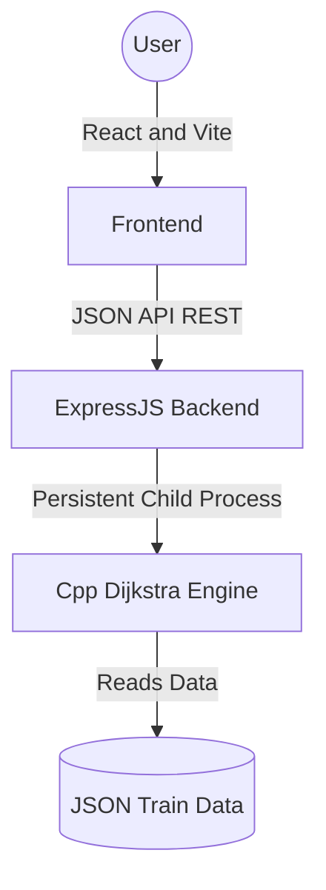

# RailYatra

**RailYatra** is a high-performance train route-finding platform. It features a custom-built C++ navigation engine capable of processing thousands of train schedules to find the most optimal multi-leg journeys across the Indian Railways network.

---

- **Station Search**: Fuzzy-matching autocomplete with keyboard navigation and typo-tolerance.
- **Train Collections**: Visual route charts for special train categories like Vande Bharat, Tejas, and Gatiman.
- **Modular Data System**: Add new train categories by dropping in JSON data files.

---

## Key Features

- **Fast C++ Engine**: Layered multi-pass Dijkstra written in C++17, finding routes in under 10ms.
- **City-Level Routing**: Multi-source, multi-destination routing — search between entire cities (e.g., "Mumbai" to "Delhi"), all station combinations explored simultaneously.
- **Route Charts**: Modular chart system for special train categories with serial numbers and detailed timings.
- **Multi-Criteria Sort**: Sort routes by travel time, total distance, or minimum switches.
- **Progressive Loading**: Fetches up to 50 routes in a single engine call, displayed 10 at a time with a "Load More" button.
- **Transfer Validation**: Validates connecting times at junctions (minimum 30 min buffer, max wait limit configurable).
- **Station Search**: Fuse.js-powered typo-tolerant autocomplete with keyboard navigation and live match highlighting.
- **Modern UI**: React 19 frontend with glassmorphism, animations, and responsive design.

---

## Dijkstra Logic

The core navigation engine implements a **Layered Multi-Pass Dijkstra** optimized for scheduled transportation networks. See [`logic.md`](logic.md) for the full technical breakdown.

### 1. Layered Pass Strategy
The engine runs one independent Dijkstra pass per transfer level (0 → 1 → 2 → … up to `maxSwitches`), stopping as soon as 10 results are collected:
- **Pass 0**: Direct routes only (0 transfers) — ranked by total travel time.
- **Pass 1**: Routes with 1 transfer — fills remaining slots, also ranked by time.
- **Pass N**: Continues until 10 unique routes are found.

This guarantees direct routes always come before 1-transfer routes in the output, regardless of cost.

### 2. Destination-Exempt Pruning
The `bestCost[station][switches]` table prunes redundant intermediate paths. Critically, the **destination station is exempt** from this pruning — every train that reaches the destination is evaluated, allowing multiple direct trains to the same endpoint to all appear in results.

### 3. Real-World Constraints
During expansion, every potential connection is validated for:
- **Chronological Validity**: Departing train must leave *after* the previous train arrives.
- **Transfer Window**: Wait time ≥ 30 min and ≤ `max_wait` (default: 20 hours).
- **Switch Budget**: Prunes branches exceeding the per-pass `maxSwitches` cap.

---

## Architecture

The project uses a three-tier setup: a React frontend talks to an Express.js backend, which delegates pathfinding to a persistent C++ child process.


```mermaid
flowchart TD
    User((User)) -->|React and Vite| FE[Frontend]
    FE -->|JSON API REST| BE[ExpressJS Backend]
    BE -->|Persistent Child Process| CE[Cpp Dijkstra Engine]
    CE -->|Reads Data| DATA[(JSON Train Data)]
```

### Key Decisions
- **C++ Engine**: The Dijkstra algorithm runs in a persistent, compiled C++17 process (`route_engine.exe`) to avoid Node.js CPU bottlenecks. Managed by `src/services/engine.service.js`.
- **Controller-Service-Route pattern**:
    - `src/api/routes/`: Endpoint definitions.
    - `src/api/controllers/`: Business logic and engine mediation.
    - `src/services/`: Background process wrappers.
- **Express.js gateway**: Lightweight HTTP bridge in `src/app.js`.
- **React 19 frontend**: Single-page app with Framer Motion animations.

### Tech Stack
- **Frontend**: React 19, TypeScript, Vite, Tailwind CSS, Framer Motion, Lucide Icons.
- **Backend**: Node.js, Express.js.
- **Engine**: C++17, `nlohmann/json` for JSON serialization.

---

## Setup & Installation

### 1. Build the Engine
Requires `g++` (MinGW-w64) installed and in your PATH.
```bash
cd engine
./build.ps1
```

### 2. Prepare Data
Ensure `master_train_data.json` and `city_stations.json` are present in the project root. The `city_stations.json` enables city-level clustered searches.

### 3. Start the Backend
```bash
cd backend
npm install
node server.js # Starts on Port 3000
```

### 4. Start the Frontend
```bash
cd frontend
npm install
npm run dev # Starts on Port 5173
```

## Project Structure

```
backend/
├── src/
│   ├── api/
│   │   ├── controllers/   # Business logic (Route search)
│   │   └── routes/        # API route definitions
│   ├── config/            # Cross-platform environment configuration
│   ├── services/          # Persistent background service wrappers
│   └── app.js             # Express application & middleware setup
├── server.js              # Entry point
├── package.json
├── stations.json
├── city_stations.json     # Mapping of major cities to their constituent stations
frontend/
├── src/                   # React components and custom hooks
├── public/                # Static assets
└── index.html
```

---

## API Reference

### `POST /api/route`
Calculates routes between two stations.
| Parameter | Type | Description | Default |
| :--- | :--- | :--- | :--- |
| `from` | `String` | Source station name or code | (Required) |
| `to` | `String` | Destination station name or code | (Required) |
| `date` | `String` | Journey date (YYYY-MM-DD) | (Required) |
| `sort_by` | `String` | `time`, `distance`, or `switches` | `switches` |
| `max_wait` | `Int` | Max wait time at transfers (minutes) | `600` (10h) |
| `max_switches`| `Int` | Max number of transfers allowed | `5` |
| `top_k` | `Int` | Number of results to return | `50` |

### `GET /api/stations`
Fuzzy-autocomplete endpoint for station search (Fuse.js). Returns top 10 matches ranked by relevance.

### `GET /api/category/:category`
Fetches trains for a specific collection (e.g., `vandebharat`, `tejas`). Returns route chart data.

### `GET /api/schedule/:trainNumber`
Fetches the full schedule for a specific train. Returns station stops, arrival/departure times, and operating days.

### `GET /api/pdf/:trainNumber`
Serves the PDF timetable for the requested train (if available).

---

## Testing & Benchmarks
The system includes a verification suite in `/tests`:
- **Correctness**: Validates that found routes actually exist in the raw JSON schedules.
- **Performance**: Measures engine latency (target: <10ms per search).
- **Integrity**: Ensures no "illegal" transfers (e.g., departing before arrival) are returned.

### Engine Throughput Benchmark
Based on local system benchmarking (Intel i5/equivalent, single-process engine):
- **Average Latency**: ~0.94 ms per route calculation.
- **Throughput**: ~1,067 requests/second.
