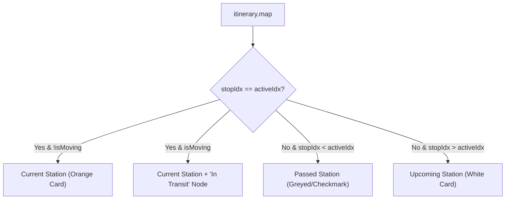

# Live Status Architecture: Deep Dive

This document provides a complete technical breakdown of how the RailYatra Live Status system works, from the initial data scraping to the final UI presentation.

---

## 1. Data Source (The Scraper)

The [scraper.py](../backend/src/scripts/scraper.py) is a procedural Python engine that mimics a browser session to fetch data from the National Train Enquiry System (NTES).

### Sequence of Operation
1.  **Session & CSRF**: A `requests.Session` is initialized. A call to `GetCSRFToken?t={ms}` is made to extract the temporary security token required for the `POST` request.
2.  **Date Targeting**: The scraper uses `timedelta` to calculate the journey start date. If the train hasn't started on the current date, it recursively falls back to "Yesterday" (up to 2 days back).
3.  **HTML Extraction**: The NTES response is a complex table. The scraper uses `BeautifulSoup` to find station "cards" (`w3-card-2`).
4.  **Column Mapping**:
    *   **Arrival**: Extracted from the first `div` in the card. It typically contains two `<b>` tags: `[Scheduled Arrival, Actual Arrival]`.
    *   **Departure**: Extracted from the third `div`'s wrapper. Similarly, it contains `[Scheduled Departure, Actual Departure]`.
5.  **Output**: Returns a JSON object with `meta` (current location string) and `itinerary` (list of stations with times and delay flags).

---

## 2. The Transformer Engine

The [transformer.service.js](../backend/src/services/transformer.service.js) is the "brain" that converts raw HTML fragments into a logical, time-sequenced journey.

### A. Time Normalization (`getAbsoluteMinutes`)
Because train journeys cross midnight, simple "HH:mm" strings are not enough.
*   **Absolute Offset**: The system converts every time to "Minutes since Day 0, 00:00".
*   **Wrap-Around Logic**: If the arrival at one station is `23:50` and departure is `00:10`, the transformer detects the 20-minute gap and adds `1440` (one day) to all subsequent times in the array.

### B. State Machine (Current Position)
The transformation detects where the train is using **Regex Pattern Matching** on the `current_location` string:
*   `BETWEEN A AND B`: Marks `activeIdx = A` and `isMoving = true`.
*   `ARRIVED AT A`: Marks `activeIdx = A` and `isMoving = false`.
*   `DEPARTED A`: Marks `activeIdx = A` and `isMoving = true`.

### C. Delay Propagation & Calculations
*   **Fix Implementation**: If `Actual Arrival` is delayed beyond the `Scheduled Departure`, the system forces the `Expected Departure` to be `Actual Arrival + Sch. Halt`.
*   **Interpolation**: When `isMoving` is true, the system calculates `progressPercent` by comparing the current clock time against the `Previous Departure` and `Next Arrival`.

---

## 3. Frontend Component Layer

The [JourneyTimeline.tsx](../frontend/src/components/LiveStatus/JourneyTimeline.tsx) component renders the processed itinerary.

### UI Mapping Logic

### Key UI Features
*   **Platform Badge**: Dynamically prefixing "PF" if missing in the data.
*   **Halt Display**: Shown only for the currently active station (`HALT: X MIN`).
*   **Average Speed**: Calculated by dividing the `currentKM` by the total elapsed time from the source.
*   **Mobile vs Desktop**: Uses `hidden md:flex` and `md:hidden` to switch between a dense row view (Desktop) and a vertically-stacked card view (Mobile).

### The Data Flow
1.  **Backend Controller**: Calls `scraper.py` → Receives Raw JSON.
2.  **Transformer**: Injects `absMins`, `activeIdx`, `isMoving`, `progressPercent`.
3.  **Frontend Hook**: Fetches transformed JSON → Passes to `JourneyTimeline`.
4.  **UI Node**: Renders based on flags (`isCurrent`, `isPassed`).
